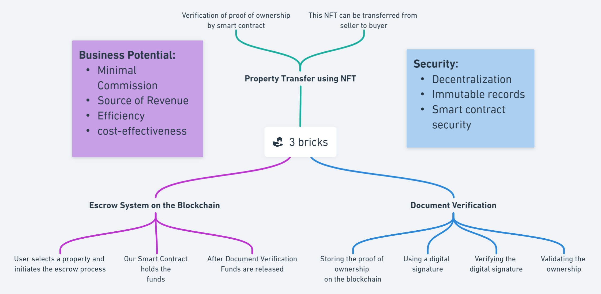

<p align="center">
  <a href="" rel="noopener">
 </a>
</p>
<h1 align="center">3 Bricks</h1>

<div align="center">

[](http://hackathon.url.com)
[]()
[](https://github.com/team-somehow/3-bricks/issues)
[](https://github.com/team-somehow/3-bricks/pulls)
[](LICENSE.md)

</div>

---

<p align="center"> Making Housing Affordable. 
</p>

## 📝 Table of Contents

-   [Problem Statement](#problem_statement)
-   [Idea / Solution](#idea)
-   [Dependencies / Limitations](#limitations)
-   [Future Scope](#future_scope)
-   [Setting up a local environment](#getting_started)
-   [Usage](#usage)
-   [Technology Stack](#tech_stack)
-   [Contributing](../CONTRIBUTING.md)
-   [Authors](#authors)
-   [Acknowledgments](#acknowledgments)

## 🧐 Problem Statement <a name = "problem_statement"></a>

The process of buying and selling property is currently time-consuming, expensive and prone to errors, especially when it comes to the transfer of ownership. This is due to the need for intermediaries such as lawyers and real estate agents, and the lack of transparency and security in the process. The goal of this project is to develop a decentralized platform using Polygon and NFTs that simplifies the process of buying and selling property, increases transparency and security, and reduces the need for intermediaries.

## 💡 Idea / Solution <a name = "idea"></a>



## ⛓️ Dependencies / Limitations <a name = "limitations"></a>

-   What are the dependencies of your project?
-   Describe each limitation in detailed but concise terms
-   Explain why each limitation exists
-   Provide the reasons why each limitation could not be overcome using the method(s) chosen to acquire.
-   Assess the impact of each limitation in relation to the overall findings and conclusions of your project, and if
    appropriate, describe how these limitations could point to the need for further research.

## 🚀 Future Scope <a name = "future_scope"></a>

Write about what you could not develop during the course of the Hackathon; and about what your project can achieve
in the future.

## 🏁 Getting Started <a name = "getting_started"></a>

### Frontend

1. Navigate to frontend folder

```bash
cd frontend
```

2. Install dependencies

```bash
npm i
```

3. Start react server

```bash
npm start
```

### MetaMask Setup

1. Install Metamask

2. connect to polygon mumbai network. By clicking on the `Add Polygon Network` in the footer of [this site](https://mumbai.polygonscan.com/)

3. Request some matic from [Polygon Mumbai Faucet](https://faucet.polygon.technology/).

## Deploying smart contract

1. Create a new app on [alchemy](https://dashboard.alchemy.com/) select `chain` as `Polygon` and `network` as `Polygon Mumbai`.

2. Create a `.env` in the `/hardhat` folder

```
ALCHEMY_URL=alchemy_api_key_here
MATIC_PRIVATE_KEY=private_key_here
```

3. Deploy smart contract. In `/hardhat` run:

```bash
npx hardhat test
npm run deploy
```

4. Update contract address in `/frontend/src/constants/index.js`

```tsx
export const contractAddress = "0xaaaaaaaaaaaa";
```

## 🎈 Usage <a name="usage"></a>

Add notes about how to use the system.

## ⛏️ Built With <a name = "tech_stack"></a>

-   [Firebase](hhttps://firebase.google.com/) - Database, Auth
-   [React](https://reactjs.org/) - Frontend Framework
-   [Hardhat](https://hardhat.org/)
-   [Polygon](https://polygon.technology/)

## ✍️ Authors <a name = "authors"></a>

-   [@Hussain]()
-   [@Arya Nair]()
-   [@Vatsal]()
-   [@VinayKanse](https://github.com/VinayKanase)

See also the list of [contributors](https://github.com/team-somehow/3-bricks/graphs/contributors)
who participated in this project.

## 🎉 Acknowledgments <a name = "acknowledgments"></a>

-   Hat tip to anyone whose code was used
-   Inspiration
-   References
